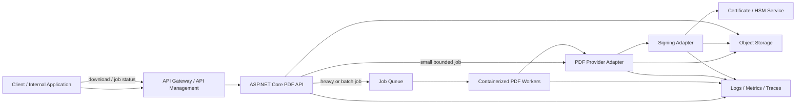
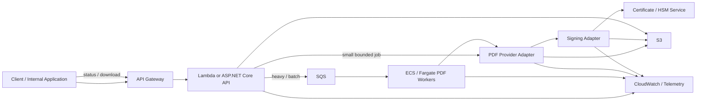
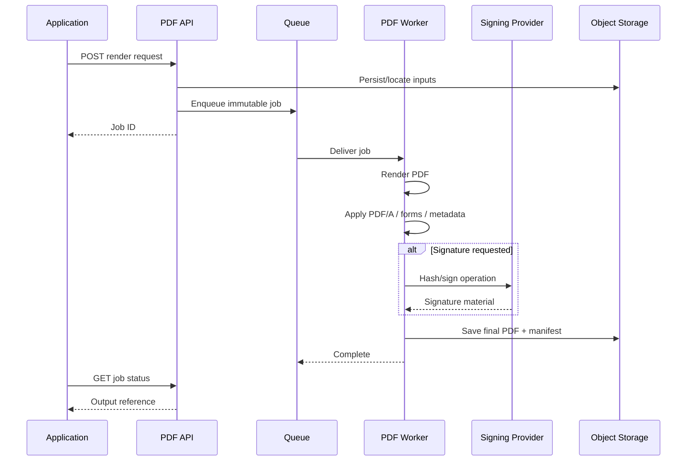
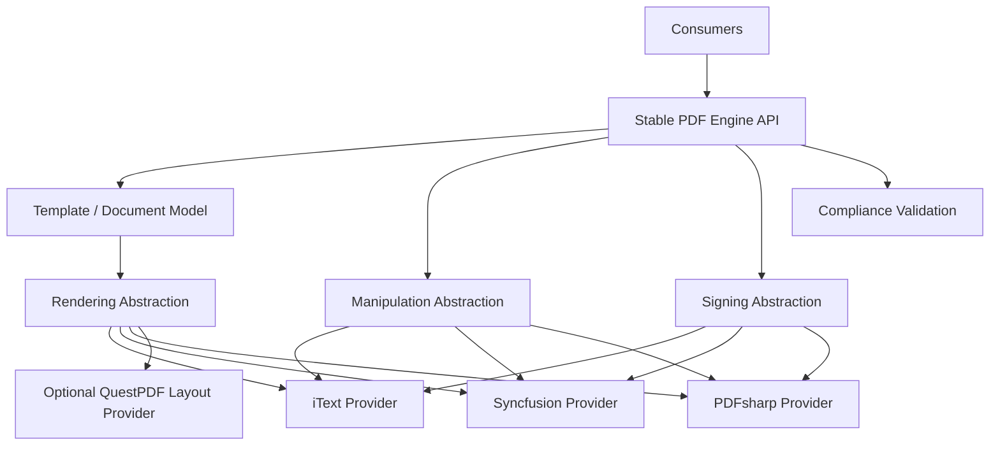

# C#/.NET PDF Libraries for a Reusable Cloud PDF Engine

## Executive summary

For a reusable PDF engine that may ultimately be exposed through an ASP.NET Core API, used by many teams, and deployed interchangeably to Azure or AWS, **there is no defensible single “fastest” C# PDF library based on public evidence**. None of the leading vendors publishes a current, reproducible, apples-to-apples benchmark covering render latency, peak memory and multi-request throughput against the competing libraries. QuestPDF, iText, Syncfusion, IronPDF and others publish performance claims or product-specific improvements, but these are not cross-vendor benchmarks. Consequently, render speed, peak memory and maximum safe concurrency should be treated as **unspecified until benchmarked against your documents**.

For the broader requirement—not merely generating invoices, but building a **general-purpose PDF engine** with forms, annotations, PDF/A, digital signatures, cloud scaling and a stable abstraction—the best overall choices are:

| Rank | Recommendation | Why |
|---|---|---|
| **Best overall: iText 9.x** | Use a commercial iText license for a closed-source/general-purpose service. | It has the strongest combination of low- and high-level PDF APIs, forms, annotations, mature signing/PAdES infrastructure, PDF/A support, extensibility and an active .NET codebase. The main disadvantages are API complexity and AGPL/commercial licensing. |
| **Best enterprise/cloud-friendly alternative: Syncfusion PDF** | Particularly attractive when Azure/AWS deployment convenience and vendor support matter. | Broad PDF feature coverage, 100% managed C#, strong conformance/signature/forms support, and unusually detailed official instructions for ASP.NET Core, Azure Functions/App Service and AWS Lambda. |
| **Best unrestricted foundation: PDFsharp + MigraDoc** | Best choice when you want an MIT-licensed engine that you can wrap, distribute and evolve without a per-vendor commercial dependency. | Cross-platform, small conceptual footprint, high-level MigraDoc plus low-level PDFsharp, and digital signatures since 6.2. The trade-off is materially lower PDF feature maturity, particularly PDF/A and forms, than iText or Syncfusion. |

There is an important distinction between **“an application that generates PDFs”** and **“a general-purpose PDF generation API/SDK that everybody can use.”** That distinction materially changes the ranking because several otherwise excellent products put explicit restrictions on exposing their functionality as a competing PDF API or SDK. QuestPDF's current published terms, for example, define a derivative application as something that is *not* itself a library/SDK primarily intended for general-purpose PDF generation and explicitly restrict using QuestPDF to operate a competing general-purpose PDF library, SDK, API or hosted service. This restriction also appears in the published commercial-license text, so a generic PDF-as-a-service product would require explicit contractual clearance rather than merely assuming a normal commercial license is sufficient.

The same issue deserves attention with IronPDF: its standard OEM/SaaS coverage does not permit an open PDF API; it documents separate SDK redistribution rights and also restricts use in competing software libraries. Aspose likewise differentiates ordinary application/OEM deployment from API/SDK scenarios. For a literal “PDF engine everybody can use,” **license architecture is therefore as important as software architecture**.

**My practical recommendation is therefore a provider architecture rather than hard-coding one vendor.** Define your own `IPdfRenderer`, `IPdfManipulator`, `IPdfSigner` and `IPdfComplianceService` contracts. Start with **iText commercial** if feature completeness is the primary requirement, **Syncfusion** if enterprise cloud operability and support are most important, or **PDFsharp/MigraDoc** if unrestricted redistribution and vendor independence dominate. Keep QuestPDF as an exceptionally attractive optional renderer for domain-specific report/layout generation, but not as the core of a public general-purpose PDF API without written licensing approval.

## Evaluation method and performance caveats

This investigation considers the current product state as of **August 7, 2026**, prioritizing official documentation, official GitHub repositories, NuGet and vendor licensing/pricing material. Current packages found include iText 9.7.0, QuestPDF 2026.7.1, PDFsharp/MigraDoc 6.2.4, Syncfusion PDF 34.2.2, Aspose.PDF 26.7.0 and IronPDF 2026.7.2. PDFsharp 7 exists as a preview, so 6.2.4 remains the safer stable baseline for a production comparison.

The analysis also includes Telerik RadPdfProcessing because its July 2026 documentation describes a current, UI-independent, cross-platform document-processing stack with PDF creation/editing, forms, signatures and a `PdfStreamWriter` path intended for large-output scenarios. Telerik is commercially bundled rather than positioned as a stand-alone open-source PDF SDK.

**Performance needs to be separated into at least five workloads.** A fluent document layout engine, a low-level PDF object model and a Chromium HTML renderer solve different problems, so comparing “one PDF generated” is misleading. QuestPDF's current architecture uses its own optimized native Skia-based layer and qpdf-based document operations, while IronPDF's HTML-to-PDF path is based on a Chrome rendering engine. Syncfusion describes its PDF library as 100% managed C#. These architectural differences make the workload especially important.

QuestPDF has one of the more concrete recent performance statements: its 2026 release information says the native Skia layer was rebuilt with speed optimizations and SIMD and that some image-heavy Windows x64 workloads can be several times faster than earlier QuestPDF behavior; the project also runs continuous performance-monitoring workflows. That is meaningful evidence of performance engineering, but **it is not evidence that QuestPDF is several times faster than iText, Syncfusion or PDFsharp**.

iText likewise reports a major table-layout performance improvement in its 9.x development, particularly for tagged tables, while older releases have included memory/performance optimization work. Again, the vendor has not published a controlled current comparison against the other engines in this report.

For Syncfusion, Aspose and IronPDF, current official pages make performance claims or document performance improvements, but no sufficiently comparable current render-speed/memory/concurrency benchmark was found. Telerik provides a `PdfStreamWriter` for large-output workflows, which is architecturally promising for memory-bound transformations, but public comparative numbers remain unspecified.

Accordingly, I would make a benchmark suite a **release gate** for the engine. At minimum, test these representative cases:

| Benchmark workload | What it exposes | Metrics to record |
|---|---|---|
| Two-page invoice | Framework overhead and cold start | cold/warm latency, CPU time, allocations |
| Fifty-page text/table report | Pagination/layout efficiency | pages/sec, p50/p95 latency, peak working set |
| Twenty-page image-heavy report | image decoding/compression | CPU, RSS, output size, bytes allocated |
| Large existing PDF merge/stamp | parser/object-model efficiency | MB/sec, peak memory, temporary disk |
| AcroForm fill/flatten | form subsystem | documents/sec, allocations |
| PDF/A generation | conformance overhead | latency, output size, validation success |
| Digitally signed PDF | crypto/signing integration | unsigned vs signed latency, remote-signing latency |
| Parallel batch | scalability | docs/sec at concurrency 1/2/4/8/16, p95 latency, OOM/failures |

The most useful production metric is usually **cost per successfully generated document at a target p95 latency**, rather than single-threaded milliseconds. A library that is 10% slower per request but uses half the memory can support substantially more workers per container; conversely, an engine with a large initialization cost may perform well in warm containers while being unattractive for scale-to-zero serverless workloads. Those relationships should be measured in your own deployment rather than inferred from marketing claims.

## Comparative analysis

The following ratings are analytical assessments rather than vendor benchmark scores. “High” in performance means there is a favorable architecture or evidence of active performance engineering; it **does not mean the product won a controlled benchmark**. Wherever no comparable public measurement exists, the quantitative metric is explicitly identified as unspecified.

| Library | Performance evidence | Feature completeness | API / maintainability | Cloud / platform | Licensing and generic-engine fit |
|---|---|---|---|---|---|
| **iText 9.7.0** | Strong performance engineering; recent table-layout optimizations. **Render speed, peak memory and concurrency numbers: unspecified.** | **Excellent.** Text/images/fonts, low-level PDF model, AcroForms, broad annotations, signatures/PAdES, PDF/A including PDF/A-4 support, encryption and many optional add-ons. | Very powerful but comparatively large API surface. Public .NET source, documentation, samples and active GitHub development; iText's .NET repository remained active in August 2026. | Designed for web/mobile/desktop/cloud .NET applications. Current package 9.7.0. | **AGPLv3 or commercial.** For proprietary/cloud/general-purpose products, commercial licensing is usually the practical route. |
| **Syncfusion PDF 34.2.2** | Vendor describes it as high-performance; 100% managed C#. **Comparable render/memory/concurrency figures: unspecified.** | **Excellent.** Creation/editing, images/fonts, forms, annotations, signatures, timestamping, CAdES, PDF/A-1/2/3/4 variants, PDF/UA, PDF/X, encryption, attachments and more. | Conventional object model, extensive current documentation and vendor support. Public implementation/test coverage percentage: **unspecified** because the product is commercial rather than a fully public source tree. | **Excellent documentation for cloud.** Official material covers ASP.NET Core/Web API, Azure deployments including Functions/App Service and AWS Lambda scenarios. | Commercial; Community License is available for qualifying organizations below its revenue/developer/employee/funding limits. Exact rights for a generic public SDK/API should be contractually reviewed. |
| **PDFsharp + MigraDoc 6.2.4** | Lightweight conventional PDF/layout architecture; compression lets developers choose CPU/size trade-offs. **Standard render/memory/concurrency benchmark: unspecified.** | **Moderate.** Excellent basic generation/drawing/layout; CMS digital signatures now supported. Forms are limited and PDF/A support is explicitly early/under construction; it cannot yet guarantee the broad compliance workflow of iText/Syncfusion. | MigraDoc supplies a higher-level paragraph/table/image document model while PDFsharp provides lower-level PDF/drawing control. Open source gives you maximum ability to inspect and patch the stack. | Core packages are independent of Windows and run on .NET-compatible Linux/macOS/Windows environments; fonts need deliberate cross-platform resolver configuration. | **MIT. Best licensing fit for a redistributable/general-purpose engine.** No commercial runtime license fee. |
| **QuestPDF 2026.7.1** | Probably the strongest public performance-engineering evidence for greenfield layout generation: optimized native Skia layer, SIMD improvements and automated benchmark workflow. Cross-library render/memory/concurrency numbers remain **unspecified**. | **Excellent for layout/report generation; incomplete as a full PDF SDK.** PDF/A-2/3, PDF/UA, merging/splitting, attachments and encryption are present; built-in X.509 signing and basic AcroForms remain roadmap items. | **Excellent ergonomics** for code-first declarative documents; strong docs and public source. Current CI includes build/test, integration-test, performance and CodeQL workflows. | Official package supports Windows/Linux/macOS, .NET 6+, Docker/Kubernetes and major cloud platforms. Native AOT remains a roadmap work item. | **Problematic for a generic PDF platform.** Published terms explicitly restrict using it primarily to build/operate a competing general-purpose PDF library/SDK/API/hosted service. |
| **Aspose.PDF 26.7.0** | Vendor describes the product as high performance, but comparable render/memory/concurrency measurements are **unspecified**. | **Excellent breadth.** Creation/manipulation/conversion, text/images/fonts, forms, annotations, security, signatures, PDF/A including PDF/A-4 and substantial format conversion. | Mature commercial API with extensive capability, but source/test coverage is not publicly assessable in the same manner as open-source libraries. | Windows/macOS/Linux support is advertised, but current Linux .NET instructions still require `libgdiplus` plus appropriate fonts, creating more container/runtime setup than a dependency-free managed implementation. | Commercial. Vendor license types distinguish ordinary applications/OEM use from API/SDK scenarios; verify the Metered/API terms before using it as a generic developer-facing PDF engine. |
| **IronPDF 2026.7.2** | Browser-based rendering is excellent for HTML/CSS fidelity, and releases document performance/memory improvements. **Comparable latency/RSS/concurrency figures: unspecified.** Its Chrome architecture makes a larger runtime footprint/cold-start burden than a simple drawing library a reasonable engineering expectation, but that must be benchmarked. | **High.** HTML-to-PDF is its particular strength; it also supports forms, document operations, security and X.509 digital signing, with PDF/A conversion capabilities documented in releases. | Very easy when HTML is already the source of truth. Less attractive as the canonical low-level PDF abstraction if you need precise PDF-object semantics. | Explicit Windows/Linux/macOS, Docker, Azure/AWS, Kubernetes/serverless support. | Commercial. SaaS/OEM coverage is additional; exposing open APIs requires SDK rights and the terms include competition restrictions. |
| **Telerik RadPdfProcessing** | No cross-library benchmark. `PdfStreamWriter` is specifically provided for large-output workflows; current docs emphasize UI-independent processing. Quantitative render/memory/concurrency: **unspecified**. | **High.** Creation/import/edit/export, text/images/shapes/tables, forms, annotations, bookmarks, signatures/validation, encryption and accessibility capabilities. | Mature commercial API with both higher-level and precise fixed-content editors; current docs, forums, feedback portal and commercial support are available. | Current cross-platform packages support .NET Standard and contemporary .NET 8/9/10 environments; fonts/images require explicit extensibility configuration in the .NET Standard path. | Commercial, included with several Telerik suites. Current ASP.NET Core suite pricing includes Document Processing and starts at $749/developer/year, increasing with support level. |

The feature difference between **QuestPDF** and the rest deserves emphasis. QuestPDF is fundamentally compelling when your input is an application object model—invoice, statement, report, label, certificate—and your output is a beautifully laid-out PDF. Its current document-operation layer also handles merge/split/overlay, attachments, encryption and linearization through qpdf. It is not currently equivalent to iText or Syncfusion as a general AcroForm/signing/annotation-oriented PDF SDK.

By contrast, **iText is closest to a programmable PDF platform**. Its Core modules expose both layout and lower-level kernel facilities, while forms, PDF/A and signing have dedicated subsystems. Its signing architecture is particularly suitable for a cloud engine because `PdfSigner` is separated from cryptographic implementation through `IExternalSignature` and `IExternalSignatureContainer`, allowing a private key operation to be delegated rather than embedding all cryptography into the rendering layer.

**Syncfusion is unusually attractive operationally.** It is 100% managed C#, its current documentation covers ASP.NET Core creation as well as Azure Functions and AWS Lambda, and its PDF conformance/signature functionality is much more complete than PDFsharp's. This combination reduces the amount of cloud-specific experimentation needed before reaching a production proof of concept.

**PDFsharp/MigraDoc is the strategic wildcard.** Its PDF/A functionality is not currently mature enough to make it the automatic choice for compliance-heavy workloads, but MIT licensing completely changes the economics and legal complexity of creating your own general-purpose abstraction. Digital signing introduced in 6.2 is also deliberately extensible: `IDigitalSigner` can be implemented by the application, while `PdfSharpDefaultSigner` uses an `X509Certificate2`.

From a security-maintenance perspective, open-source visibility is strongest with QuestPDF, iText and PDFsharp. QuestPDF's current security policy states that document processing is local, external telemetry/network calls are not made by the library, its native Skia/qpdf components are built from source, and security issues can be reported privately; its GitHub workflows also expose CodeQL and dependency/update automation. iText's current release history demonstrates active security maintenance—for example, 9.6 addressed a .NET transitive dependency associated with CVE-2024-21907—and current iText also provides a Bouncy Castle FIPS adapter.

## Recommended top choices

**iText 9.x — first choice for a true general-purpose PDF engine.**
Choose iText when “PDF engine” means more than rendering pages: creating and modifying existing PDFs, annotations, AcroForms, archival conformance, advanced digital signatures, incremental signing, external signers and low-level PDF manipulation. Current iText Core 9 is available for .NET under AGPL or commercial licensing, and the public .NET repository remains actively maintained.

Its digital-signature design is especially good for a cloud platform. `PdfSigner` handles PDF-specific signing while cryptographic operations can be supplied through interfaces. The current documentation supports CMS and CAdES/PAdES-oriented signing and optional timestamps/revocation material; this lends itself naturally to a separate signing adapter or HSM-backed signing service.

The major downside is commercial and architectural complexity. Under AGPL, network-accessible proprietary software has obligations that usually make the commercial license preferable for a closed-source SaaS platform. The API is also much broader and lower-level than QuestPDF, so your own façade is important if hundreds of application developers will consume the engine.

**Syncfusion PDF — second choice and potentially first for enterprise cloud teams.**
Syncfusion should move to first place when operational simplicity, official cloud examples and vendor support outweigh the benefit of iText's more open/public implementation. The current PDF library is 100% managed C#, covers forms, annotations, signatures and extensive PDF/A variants, and has official ASP.NET Core, Web API, Azure and AWS guidance.

Its signing APIs accept an `X509Certificate2` through `PdfCertificate`, support timestamp-related workflows and document CAdES/digest configuration. For serverless environments, the API also provides certificate-stream constructors, avoiding an unnecessary dependency on a persistent local filesystem.

The principal caveat is long-term vendor and licensing dependency. Syncfusion's Community License can be generous for qualifying small organizations, but a public, reusable PDF platform should have its redistribution/API rights reviewed against the actual commercial agreement rather than assuming the small-business license automatically covers every SaaS/SDK topology.

**PDFsharp + MigraDoc — third overall, but first for an open/unrestricted reusable engine.**
If “everybody can use” means you intend to publish an SDK, distribute the engine to customers, offer a generic API, permit downstream embedding or avoid vendor licensing negotiations entirely, PDFsharp's MIT license is a decisive advantage. Its Core and MigraDoc packages are cross-platform and give you a useful split between low-level PDF operations and a higher-level document model.

Digital signatures substantially improved this option in 6.2: PDFsharp supports CMS signatures, an `X509Certificate2`-based default signer and the extensible `IDigitalSigner` interface. The implementation can also reuse signer instances, which the documentation notes avoids repeating a signature-size/timestamp discovery round trip after the initial signing operation.

Its limitation is feature completeness. PDFsharp's own PDF/A documentation describes the support as early/under construction: creating new archival PDFs is possible, but conversion and assurance that arbitrary imported content is conformant are not at iText/Syncfusion maturity. Forms are also comparatively limited. Therefore, the unrestricted-license choice can translate into **more engineering that you own**.

A useful decision rule is:

| Your dominant requirement | Preferred choice |
|---|---|
| General-purpose enterprise PDF manipulation + signing + compliance | **iText commercial** |
| Enterprise feature set + easiest documented Azure/AWS integration | **Syncfusion PDF** |
| Public/general-purpose API or SDK with minimum licensing restrictions | **PDFsharp/MigraDoc** |
| Domain-specific reports/invoices with exceptional developer ergonomics | **QuestPDF**, subject to license fit |
| HTML/CSS/JavaScript is already your canonical template language | **IronPDF** |
| Extreme conversion breadth across document formats | **Aspose.PDF** |
| Existing Telerik/DevCraft ecosystem | **RadPdfProcessing** |

QuestPDF would otherwise rank extremely highly for new report-generation applications. Its fluent API, PDF/A/PDF/UA work, optimized rendering and cloud compatibility make it one of the strongest code-first layout choices. The reason it is outside this report's top three is specifically the combination of **currently planned rather than built-in signing/forms** and the license restriction around a competing general-purpose PDF API/SDK/service.

## Cloud architecture patterns

The engine should be **asynchronous by default for expensive jobs, while retaining a bounded synchronous fast path** for small documents. This protects request latency from image-heavy reports, font loading, large merges, PDF/A work and remote digital-signature operations.

More importantly, the public service should depend on **your interfaces, not a vendor's classes**:

```text
API contract
   |
   +-- IPdfRenderer
   +-- IPdfManipulator
   +-- IPdfComplianceService
   +-- IPdfSigner
   +-- IPdfValidator
          |
          +-- ITextProvider
          +-- SyncfusionProvider
          +-- PdfSharpProvider
          +-- Optional QuestPdfLayoutProvider
```

That separation makes licensing changes, performance migrations and future vendor changes much less painful. It also allows a hybrid implementation—for example, a high-level layout renderer for invoices and iText for post-processing/signatures—without exposing either vendor's object model to hundreds of consumers.

**Azure reference architecture**



For Azure, **Functions Flex Consumption** is attractive for lightweight admission, orchestration or smaller bounded PDF operations because Azure supports per-function scaling and configurable concurrency behavior. For sustained/heavy rendering, Azure Container Apps provides a managed serverless-container model with event-driven scaling and scale-to-zero, avoiding the need to make a native-heavy PDF runtime conform to a particularly restrictive function model. Azure Functions Premium is an alternative when prewarmed workers and stronger instance control are important.

That is particularly relevant because different libraries package very different runtime dependencies. QuestPDF ships native rendering/document-operation components, Aspose documents `libgdiplus`/font requirements on Linux, and IronPDF carries a Chromium-oriented rendering architecture. Containers make these dependencies explicit and versionable. Syncfusion's managed-C# architecture is comparatively attractive for function/serverless packaging, and Syncfusion publishes a specific Azure Functions guide.

For an Azure workload, I would therefore use the function/API layer for authentication, validation, idempotency and job submission and let a queue-driven worker fleet do the expensive PDF work. Azure's current function documentation also recommends the isolated worker model as the older in-process model approaches end of support on November 10, 2026.

**AWS reference architecture**



AWS itself publishes an asynchronous pattern using API Gateway, SQS and Fargate for jobs whose processing should be separated from the request lifecycle. ECS can scale horizontally by adding task replicas and vertically by increasing task CPU/memory, which is exactly the flexibility useful for CPU- and memory-sensitive PDF rendering.

Scaling should preferably follow **queue backlog per worker combined with observed processing time**, rather than CPU alone. AWS explicitly documents backlog-per-instance calculations for queue-driven capacity because queue depth alone does not reflect processing rate and acceptable latency. The same principle can be implemented on Azure with event-driven container scaling.

Syncfusion publishes a specific AWS Lambda PDF-generation path, while QuestPDF and IronPDF advertise cloud/serverless compatibility. Nevertheless, for an engine intended to accept arbitrary templates, images, document sizes and signing workloads, I would favor **Fargate/Container Apps for rendering workers** and reserve Lambda/Functions primarily for the control plane or carefully bounded render profiles.

A Kubernetes variant is justified only when your organization already operates Kubernetes or requires sophisticated multi-tenant isolation. Azure AKS is a managed Kubernetes service, and AWS publishes an EKS/KEDA queue-scaling pattern that can scale pods from SQS backlog down to zero when there is no queue work. For a new PDF service alone, Container Apps or ECS/Fargate has substantially less operational surface.

At the application level, workers should use bounded parallelism. Do **not** create an unlimited `Task.Run` for every PDF inside one instance. Benchmark the optimal documents-per-process value for every render profile and set worker concurrency from observed memory headroom. A useful production controller is:

```text
allowed_concurrency =
    min(
        CPU_based_limit,
        available_memory / p95_memory_per_document,
        configured_safety_limit
    )
```

This is more robust than assuming a library is globally “thread safe.” A document object and its streams should normally remain request/job scoped; immutable font/image caches can be shared only where the chosen vendor explicitly supports the pattern.

The service API should preferably pass large payloads through object storage rather than repeatedly buffering multi-megabyte PDFs through HTTP and queues. Job messages should carry an object identifier, requested operations, template/version, output profile and idempotency key rather than the full PDF binary.

A production pipeline therefore becomes:



Splitting signing from rendering has an additional security benefit. iText explicitly supports external-signature abstractions rather than requiring the rendering component to possess a raw private key; PDFsharp similarly lets an application implement `IDigitalSigner`. This allows the architecture to keep private-key operations behind a narrowly scoped signing boundary.

## Implementation examples

The most important code decision is to stop vendor types at the adapter boundary. A small initial contract can look like this:

```csharp
public sealed record PdfRenderRequest(
    string TemplateId,
    IReadOnlyDictionary<string, object?> Data,
    bool PdfA = false);

public sealed record PdfSigningRequest(
    Stream UnsignedPdf,
    string KeyId,
    string? Reason = null);

public interface IPdfRenderer
{
    Task<byte[]> RenderAsync(
        PdfRenderRequest request,
        CancellationToken cancellationToken = default);
}

public interface IPdfSigner
{
    Task<byte[]> SignAsync(
        PdfSigningRequest request,
        CancellationToken cancellationToken = default);
}
```

Do not expose `PdfDocument`, `Document`, `PdfPage`, `PdfSignature`, `XGraphics`, etc. in your public API. Doing so makes a future provider migration effectively an application-wide breaking change.

A **simple iText renderer** can remain stream based:

```csharp
using iText.Kernel.Pdf;
using iText.Layout;
using iText.Layout.Element;

public static byte[] CreatePdfWithIText()
{
    using var output = new MemoryStream();

    using (var writer = new PdfWriter(output))
    using (var pdf = new PdfDocument(writer))
    using (var document = new Document(pdf))
    {
        document.Add(new Paragraph("PDF Engine"));
        document.Add(new Paragraph(
            "Generated by the iText provider."));
    }

    return output.ToArray();
}
```

This follows iText's documented .NET pattern of `PdfWriter` → `PdfDocument` → layout `Document` → layout elements.

For **iText digital signing**, the more important pattern is the abstraction rather than hard-coding a PFX file:

```csharp
using iText.Kernel.Pdf;
using iText.Signatures;
using Org.BouncyCastle.X509;

public static byte[] SignWithIText(
    byte[] unsignedPdf,
    IExternalSignature externalSignature,
    X509Certificate[] certificateChain)
{
    using var input = new MemoryStream(unsignedPdf);
    using var output = new MemoryStream();

    var reader = new PdfReader(input);

    var signer = new PdfSigner(
        reader,
        output,
        new StampingProperties());

    IExternalDigest digest = new BouncyCastleDigest();

    signer.SignDetached(
        digest,
        externalSignature,
        certificateChain,
        null,   // CRL clients
        null,   // OCSP client
        null,   // TSA client
        0,
        PdfSigner.CryptoStandard.CADES);

    return output.ToArray();
}
```

The current iText signing API documents `PdfSigner`, `IExternalSignature`, `IExternalSignatureContainer`, optional OCSP/CRL/timestamp components and CMS/CAdES modes. In a real cloud engine, `externalSignature` should be implemented by a signing adapter rather than loading a production private key into ordinary application configuration.

A **Syncfusion generation-and-signing** implementation is considerably more compact:

```csharp
using Syncfusion.Pdf;
using Syncfusion.Pdf.Graphics;
using Syncfusion.Pdf.Security;

public static byte[] CreateAndSignWithSyncfusion(
    Stream pfx,
    string pfxPassword)
{
    using var output = new MemoryStream();

    using var document = new PdfDocument();
    PdfPage page = document.Pages.Add();

    PdfFont font =
        new PdfStandardFont(PdfFontFamily.Helvetica, 14);

    page.Graphics.DrawString(
        "Generated by the PDF Engine",
        font,
        PdfBrushes.Black,
        new PointF(40, 40));

    var certificate =
        new PdfCertificate(pfx, pfxPassword);

    var signature = new PdfSignature(
        document,
        page,
        certificate,
        "ApprovalSignature")
    {
        Bounds = new RectangleF(40, 100, 200, 60),
        Reason = "Document approved"
    };

    document.Save(output);

    return output.ToArray();
}
```

Syncfusion's current API documentation provides `PdfCertificate(Stream, string)` specifically as a supported constructor and `PdfSignature` for applying the certificate to the PDF; it also supports wrapping an `X509Certificate2`.

With **PDFsharp**, signing is also separable from rendering:

```csharp
using PdfSharp.Pdf;
using PdfSharp.Drawing;
using PdfSharp.Pdf.Signatures;
using PdfSharp.Cryptography;

// Assume GetCertificate() returns a securely loaded X509Certificate2.
// Assume SignatureAppearanceHandler implements the visual appearance.

var document = new PdfDocument();
var page = document.AddPage();

using (var gfx = XGraphics.FromPdfPage(page))
{
    gfx.DrawString(
        "Generated with PDFsharp",
        new XFont("Arial", 14),
        XBrushes.Black,
        new XPoint(50, 80));
}

var signer = new PdfSharpDefaultSigner(
    GetCertificate(),
    PdfMessageDigestType.SHA256);

var options = new DigitalSignatureOptions
{
    ContactInfo = "PDF Engine",
    Location = "Cloud",
    Reason = "Document approval",
    Rectangle = new XRect(50, 120, 200, 50),
    AppearanceHandler = new SignatureAppearanceHandler()
};

DigitalSignatureHandler.ForDocument(
    document,
    signer,
    options);

document.Save("signed.pdf");
```

PDFsharp 6.2's official documentation describes this `DigitalSignatureHandler`/`PdfSharpDefaultSigner` pattern and also exposes `IDigitalSigner` when an application needs to supply its own signing implementation. Its documentation explicitly warns against putting real certificate passwords/private keys in source code.

For PDF/A, **provider capabilities should be surfaced explicitly rather than hidden**. For example:

```csharp
[Flags]
public enum PdfCapabilities
{
    BasicGeneration = 1 << 0,
    ExistingPdfEditing = 1 << 1,
    Forms = 1 << 2,
    Annotations = 1 << 3,
    DigitalSignatures = 1 << 4,
    PdfA2 = 1 << 5,
    PdfA3 = 1 << 6,
    PdfA4 = 1 << 7,
    Accessibility = 1 << 8,
    HtmlRendering = 1 << 9
}

public interface IPdfProvider
{
    string Name { get; }
    PdfCapabilities Capabilities { get; }
}
```

This prevents a provider migration from silently degrading behavior. An iText or Syncfusion provider may advertise broad PDF/A capabilities; a PDFsharp provider should advertise only what the particular implementation has proven through your conformance tests, because PDFsharp itself characterizes its current PDF/A support as early-stage.

For ASP.NET Core, keep endpoints similarly provider-neutral:

```csharp
app.MapPost("/v1/pdf/render",
    async (
        PdfRenderRequest request,
        IPdfRenderer renderer,
        CancellationToken ct) =>
    {
        byte[] pdf = await renderer.RenderAsync(request, ct);

        return Results.File(
            pdf,
            "application/pdf",
            "document.pdf");
    });
```

For substantial documents, the endpoint should instead persist/identify the input, enqueue a job and return a job identifier; Syncfusion's current documentation confirms the library can be used directly from ASP.NET Core Web API applications, while iText positions its .NET package for web/cloud use.

## Licensing, security and maintenance

Licensing is unusually important for this project because **some licenses that are perfectly acceptable for adding PDF generation to a business application are not necessarily acceptable for selling or operating “a PDF engine.”**

| Library | Free/open option | Commercial / SaaS implication | Indicative current cost evidence |
|---|---|---|---|
| **iText** | AGPLv3. | Commercial license recommended for proprietary closed-source SaaS/products; iText expressly markets Core for embedding into software. | Commercial pricing is quote-based in the cited current material; **unspecified** here rather than guessing. |
| **PDFsharp/MigraDoc** | **MIT.** | No proprietary runtime/API licensing dependency from PDFsharp itself. | **$0 library license fee.** |
| **QuestPDF** | Community option for qualifying individuals, open-source/academic/nonprofit uses and small businesses below its revenue threshold. | The published license restricts using QuestPDF primarily to build/operate a competing general-purpose PDF library, SDK, API or hosted service. Written vendor agreement is essential for this project's literal generic-engine scenario. | Paid Professional/Enterprise licensing exists; a relevant generic-engine price is **not specified** in the cited material because the standard published restriction is more important than headline seat price. |
| **Syncfusion** | Community License for qualifying organizations with limits on annual revenue, developer/employee count and outside funding. | Commercial license otherwise; confirm generic API/SDK redistribution terms during procurement. | Exact suitable public-PDF-engine commercial price: **unspecified** here. |
| **Aspose.PDF** | Evaluation, not an MIT-style production license. | OEM/API/SDK rights differ; vendor documentation states only particular Metered licensing models cover API use, so a developer-facing service requires careful license selection. | Current official pricing material shows examples around **$1,199** for Developer Small Business, **$3,597** for Developer OEM and Metered offerings beginning around **$1,999/month**, depending on plan. |
| **IronPDF** | Trial/evaluation. | Standard Team licenses do not automatically cover SaaS. OEM/SaaS redistribution is an add-on; an open developer-facing API requires SDK redistribution rights and competition restrictions apply. | Current page lists Lite **$999**, Plus **$1,499**, Professional promotional price **$2,399**, Unlimited promotional price **$4,799**; OEM/SaaS redistribution is shown as a **$1,999** add-on. Prices can change. |
| **Telerik RadPdfProcessing** | Thirty-day trial; commercial in production. | Bundled with multiple Telerik product suites. | Current ASP.NET Core suite pricing including Document Processing is shown at **$749 / $849 / $1,249 per developer per year**, varying by support level. |

For **security**, treat rendering and signing as separate trust zones. PDFsharp's own signing documentation advises protecting certificates and private keys rather than embedding passwords in source. iText's external-signature interfaces make this separation particularly clean. The renderer should request a signature operation from the signing provider and should not need permanent access to exportable private-key material.

Untrusted PDF and HTML inputs require resource controls. Set maximum input bytes, maximum output pages, execution deadlines, image pixel limits and queue-level retry/dead-letter policies. For browser-oriented renderers such as IronPDF, network access by rendering containers should also be deliberately controlled because the rendering architecture includes Chrome and may process HTML/CSS resources; do not give arbitrary customer HTML an unrestricted network path merely because PDF generation runs in a backend service.

Native and cryptographic dependencies belong in the supply-chain review. QuestPDF currently builds its Skia/qpdf native components from source and exposes CodeQL/dependency automation in its public project; iText's recent release history shows active remediation of transitive .NET dependencies and provides Bouncy Castle/FIPS-oriented packages.

PDF/A should not be treated as “set an enum and forget it.” iText's PDF/A examples explicitly require details such as an output intent and embedded fonts, while Syncfusion documents explicit conformance APIs and PDFsharp acknowledges important limitations in its current archival implementation. For archival/regulatory use, run every representative output class through an independent conformance validator as part of CI and periodically validate real production samples.

A useful **migration and maintenance checklist** is:

| Control | What the PDF platform should enforce |
|---|---|
| **Provider isolation** | No vendor types cross the `IPdf*` adapter boundary. |
| **Golden-document tests** | Keep representative invoices, tables, multilingual fonts, SVG/images, RTL/complex-script documents, forms, annotations and signed PDFs. |
| **Visual regression** | Rasterize representative outputs in CI and detect page-layout differences after library/runtime upgrades. |
| **Structural regression** | Verify page count, metadata, bookmarks, attachments, form fields, annotations, encryption and signature state—not only pixels. |
| **Compliance validation** | Independently validate every PDF/A/PDF-UA profile that your public contract promises. |
| **Performance gates** | Record cold/warm p50/p95, docs/sec, CPU, peak RSS, allocations, output size and concurrency scaling before every major engine upgrade. |
| **Version pinning** | Pin NuGet packages and container/native dependency versions; do not float PDF libraries in production. |
| **Security lifecycle** | Track vendor security/release feeds, transitive package CVEs and native component changes. |
| **Font governance** | Package approved fonts explicitly, verify font redistribution rights, test Linux font resolution and avoid relying on workstation-installed fonts. PDFsharp, for example, requires deliberate portable font resolution. |
| **Signing boundary** | Keep certificate/HSM access out of ordinary rendering workers; use an `IPdfSigner`/external-signature adapter and audit every signing operation. |
| **License gate** | Treat a change from internal PDF generation to public SaaS/API/SDK as a licensing event. This is particularly material for QuestPDF, IronPDF and Aspose. |
| **Provider escape plan** | Maintain at least one second provider proof-of-concept so that a price, license, runtime or security change does not force a ground-up rewrite. |

The strongest long-term architecture is therefore **not “choose a PDF NuGet package and use it everywhere.”** It is a small, stable PDF platform contract backed by replaceable providers:



For the stated goal, my final selection would be **iText commercial as the default full-feature provider, PDFsharp/MigraDoc as the strategic MIT fallback/reference implementation, and Syncfusion as the strongest alternative to benchmark against iText**. That combination gives you one very complete PDF SDK, one unrestricted implementation you can always control yourself, and one exceptionally cloud-friendly commercial competitor.

Before committing commercially, I would run the benchmark matrix above against **iText, Syncfusion and PDFsharp**, with QuestPDF added for report-generation workloads. A performance decision without that test would be speculation: public sources currently do not provide comparable p95 latency, memory or concurrency data. QuestPDF's benchmark infrastructure and SIMD work make it especially worth including, but its current signing/forms roadmap and generic-PDF-service license restriction must be evaluated separately from raw rendering speed.
