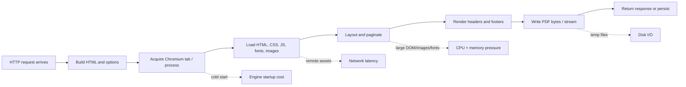
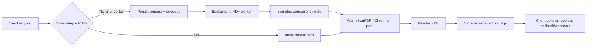

# IronPDF Performance Problems in a .NET 10 API

## Executive summary

IronPDF on .NET 10 is best understood as a **managed ASP.NET Core request pipeline wrapped around a native Chromium/CEF rendering engine**. The most important consequence is that many of the biggest delays are **not** ordinary .NET business-logic delays: they come from Chromium startup, HTML/CSS/JavaScript layout, remote asset loading, image decoding, font resolution, temporary-file I/O, and memory retained by warm browser processes. IronPDF’s own documentation confirms that `ChromePdfRenderer` uses the actual Chrome/Chromium engine rather than WebKit, and that `IronCefSubprocess` is a required part of its multi-process architecture. citeturn30view0turn30view1turn29view1

For a .NET 10 API, the highest-value improvements are usually these: **upgrade IronPDF first**, **pre-initialize the engine at startup**, **keep browser pooling enabled but tuned for your RAM budget**, **cap concurrency deliberately instead of letting every request render at once**, **avoid disk round-trips by streaming in memory**, **localize fonts/assets**, **split very large HTML/PDF jobs**, and **move heavy rendering off the synchronous request path into a background queue or dedicated worker service**. IronPDF explicitly documents that initialization can remove a **1–3 second** first-render penalty, that the browser pool reuses warm tabs to avoid subprocess startup cost, that each idle warm tab costs roughly **50–100 MB** of RAM, and that large HTML should often be rendered in sections and merged afterward. Microsoft’s ASP.NET Core guidance separately recommends completing long-running and CPU-intensive work out of process or in background services rather than inside ordinary HTTP request handling. citeturn13view4turn25view0turn5view1turn9view4

The most common performance failure modes in production are: **CPU saturation** from parallel Chromium renders, **memory pressure** from large DOMs/images/fonts plus warm browser tabs, **temp-disk bottlenecks** from ephemeral storage, **thread-pool starvation** caused by synchronous waiting or oversized inline work during request handling, and **environment mismatch** on Linux/containers/Azure where GPU mode, permissions, dependencies, and available memory differ from local Windows development. Microsoft’s diagnostics guidance shows that thread-pool starvation presents as rising `dotnet.thread_pool.thread.count`, slow latency growth, and often low CPU relative to latency; IronPDF’s environment documentation separately recommends disabling GPU in Docker/cloud, using a writable temp path, and avoiding under-provisioned plans such as Azure Free for serious rendering workloads. citeturn37view1turn37view3turn16view0turn14view0turn21view0turn15view0

Because you did not specify workload size, document complexity, latency SLOs, or concurrency, this report assumes **no hard workload constraints** and prioritizes guidance that is robust across low-latency APIs, bursty workloads, and batch generation pipelines. Where exact gains depend heavily on workload, I call them **directional estimates** rather than guaranteed numbers.

| Priority | Action | Expected impact | Main trade-off |
|---|---|---:|---|
| Highest | Upgrade to the latest IronPDF and validate changelog regressions/fixes | High when you are on older builds; official changelog includes memory-leak fixes in merging and PDF/A conversion. citeturn6search8turn28search1turn28search2 | Requires regression testing |
| Highest | `Installation.Initialize()` during startup | Removes cold-start delay, typically **1–3 s** on first render. citeturn13view4 | Longer startup / warm-up |
| Highest | Queue heavy renders and bound concurrency | Usually the largest p95/p99 win for APIs handling medium/large PDFs. ASP.NET explicitly recommends background/out-of-process execution for CPU-intensive work. citeturn9view4 | More architecture and operational complexity |
| High | Keep browser pooling enabled, but reduce idle tabs in small-memory environments | Latency improvement from warm tabs; memory cost of about **50–100 MB per idle tab**. citeturn25view0 | Higher steady-state RAM |
| High | Stream in memory instead of writing PDFs to disk | Avoids disk I/O and is better for cloud/web services. citeturn27view0turn27view5 | Memory usage per request must be controlled |
| High | Localize assets and install/cache fonts | Reduces network wait and rendering variability. citeturn5view2turn17search2turn17search0 | More packaging/deployment work |
| Medium | Disable unnecessary JavaScript, form creation, backgrounds, and overly conservative waits | Often material for static templates; mostly workload-dependent. citeturn22view1turn23view0turn23view3turn21view4 | Can break fidelity if disabled incorrectly |

## How IronPDF becomes slow

IronPDF’s rendering path is Chromium-centric. `ChromePdfRenderer` uses the Chrome browser engine; IronPDF’s “stability and performance” milestone explains that the product relies on Chromium Embedded Framework, and `IronCefSubprocess` exists specifically to support Chromium’s multi-process, multi-threaded model. That means PDF generation cost is dominated by **browser-style rendering work**: DOM construction, CSS cascade, layout, JavaScript execution, image decoding, font lookup, header/footer composition, and asset retrieval. In practice, this is why high-fidelity rendering is accurate but expensive compared with simple PDF canvas libraries. citeturn30view0turn29view1turn30view1



The first bottleneck is often **cold-start initialization**. IronPDF documents that the initial render normally takes roughly **2–3 seconds**, and that `Installation.Initialize()` can preload Chrome and dependencies to eliminate the first-render delay, saving **1–3 seconds**. This is a startup optimization, not a throughput optimization, but in APIs it often dominates p50 latency in cold pods, just-scaled instances, and recycled App Service workers. citeturn21view0turn13view4

The second bottleneck is **CPU-bound rendering concurrency**. IronPDF supports async and multithreading with `ChromePdfRenderer`, and it is thread-safe, but the library also exposes a `ChromeBrowserLimit` whose default is `Environment.ProcessorCount`, which is a clear signal that renderer concurrency must be matched to CPU capacity. The browser pool documentation further notes diminishing returns from keeping many tabs alive because CEF serializes some event handling through a single thread; most workloads see little benefit beyond about **CPU cores / 2** for idle warm tabs. In other words, “more requests in parallel” is not the same thing as “higher throughput.” citeturn19search4turn13view2turn25view0

The third bottleneck is **memory growth that is partly expected and partly avoidable**. IronPDF’s own disposal guide states that disposing `PdfDocument` does **not** shut down Chrome; once initialized, the Chrome engine remains running until the process exits. In addition, browser pooling intentionally retains warm tabs, and IronPDF documents that each idle tab typically consumes about **50–100 MB** of RAM and retains the previous document’s DOM until reused or aged out. This is why “memory never returns to zero” is not, by itself, proof of a leak. Real leaks do exist in some older versions, however: the IronPDF changelog includes fixes for a merge-related memory leak and a PDF/A conversion memory leak, and IronPDF’s own troubleshooting page says to update first and dispose `IDisposable` objects. citeturn27view2turn25view0turn6search8turn28search1turn28search2

The fourth bottleneck is **large documents and heavy headers/footers**. IronPDF’s performance guidance recommends splitting large HTML into sections and merging the results later. Its rendering options also expose `MaxDynamicHFPagesPerBatch`, documented as a direct speed-versus-memory knob: higher values reduce the number of header/footer render calls and are faster, but they increase peak memory; lower values reduce peak memory but increase render-call count. For very large PDFs, IronPDF also points to the .NET `byte[]` size limitation around **2 GB** and recommends page-based splitting. citeturn5view1turn23view3

The fifth bottleneck is **fonts, images, and remote assets**. IronPDF explicitly recommends resizing images to the actual display size, embedding images as Data URIs when appropriate, downloading remote assets locally, and installing required fonts directly on the server. Its international-language guidance adds that the required typeface must exist on the server, and its web-font documentation confirms that external web fonts and local `@font-face` fonts are both supported. Whenever fonts or images are remote, every render inherits network variability, DNS/TLS cost, and failure modes that have nothing to do with .NET or IronPDF itself. citeturn5view2turn17search2turn17search0

The sixth bottleneck is **HTML timing and wait strategy**. JavaScript execution is enabled by default, timeout defaults to **60 seconds**, and the default `WaitFor` behavior is effectively “wait for nothing.” IronPDF therefore provides precise controls such as `RenderDelay`, `NetworkIdle0`, `NetworkIdle2`, and a JavaScript trigger via `window.ironpdf.notifyRender()`. This is a critical performance-and-correctness point: too little waiting yields incomplete or blank PDFs; too much waiting inflates latency and ties up CPU, memory, and request slots. For dynamic pages, precise waits are usually better than a blanket delay. citeturn22view1turn22view0turn21view1turn21view3turn21view4

| Bottleneck | Why it happens in IronPDF | What to watch | Best first fix |
|---|---|---|---|
| Cold starts | Chromium/CEF initialization and dependency loading. citeturn21view0turn13view4 | First request much slower than later ones | Pre-initialize at startup |
| CPU saturation | HTML/CSS/JS layout and rendering are browser workloads. citeturn29view1turn30view2 | CPU near saturation, p95 rising with concurrency | Bound render concurrency |
| Memory pressure | Warm Chrome engine, pooled tabs, large DOMs/images/fonts. citeturn27view2turn25view0turn35view1 | Working set, GC committed bytes, OOMs | Lower idle tabs, split jobs, reduce image/font payload |
| Temp-disk I/O | Temp files and engine deployment use temp storage. citeturn13view4turn14view0 | Slow temp volume, throttled ephemeral disk | Put temp path on fast writable storage |
| Remote-asset latency | Fonts/images/CSS/JS fetched over network. citeturn5view2turn21view3 | High latency variance, timeouts, blank/missing assets | Localize assets, cache fonts |
| Header/footer amplification | Dynamic H/F batches trade speed vs peak RAM. citeturn23view3 | Large-doc RAM spikes | Tune `MaxDynamicHFPagesPerBatch` |
| Over-waiting / under-waiting | Wrong `WaitFor`, JS enabled needlessly, large default timeouts. citeturn22view1turn21view4 | Incomplete pages or inflated latency | Disable unneeded JS; use precise waits |

## .NET 10 runtime and deployment effects

On .NET 10, you should expect runtime improvements to help the **API shell** around IronPDF more than the Chromium rendering engine itself. Microsoft’s .NET 10 runtime notes describe further JIT improvements and code-generation enhancements, and .NET runtime metrics expose JIT compilation time and compiled methods to measure startup effects. But because IronPDF’s heaviest rendering work happens inside Chromium/CEF and native subprocesses, .NET JIT improvements primarily accelerate request handling, template preparation, serialization, stream orchestration, and your own surrounding code—not the full cost of browser layout itself. That is an inference, but it follows directly from IronPDF’s native Chromium architecture plus Microsoft’s description of what JIT metrics measure. citeturn9view8turn35view5turn29view1turn30view1

Native AOT can still matter, especially for cold-start-sensitive APIs and containers. Microsoft documents that Native AOT can reduce startup time, disk footprint, memory demand, and container image size, and it is supported for some ASP.NET Core app shapes. However, Microsoft also documents that not all ASP.NET Core features are supported in Native AOT; for example, Minimal APIs are supported, while MVC is not. On Windows, apps published with Native AOT use the Windows thread pool by default, and Microsoft notes that `ThreadPool.SetMinThreads` / `SetMaxThreads` are ineffective when that thread-pool mode is active. In a PDF API, that means AOT is most attractive for **small minimal APIs that orchestrate PDF workers**, not as a blanket assumption that the whole rendering stack becomes faster. citeturn9view2turn9view3turn10view0turn9view10

Garbage collection settings matter most in **memory-constrained** environments. ASP.NET Core defaults to **Server GC**, which Microsoft says is usually better on typical web servers where CPU matters more than memory. But Microsoft also says **Workstation GC may be more performant in small containers or high-density hosting** where memory is scarce. Separately, `.NET` supports `HeapHardLimit` and `HeapHardLimitPercent`; in containerized environments, the container memory limit is treated as physical memory, and the default heap-hard-limit-percent behavior is container-aware. This matters for IronPDF because large HTML documents, image-heavy content, and warm Chromium tabs can create large working sets; if the process is close to cgroup or App Service memory limits, GC behavior becomes part of end-to-end render latency. citeturn9view7turn36view0turn36view1turn36view2turn36view3turn9view1

Thread-pool behavior is another frequent source of “IronPDF is slow” reports that are really **API scheduling problems**. Microsoft’s guidance says ThreadPool starvation occurs when there are no free threads, and the signature is a rising `dotnet.thread_pool.thread.count`, often to **2–3× core count**, while CPU remains well below 100%. The most common cause is sync-over-async blocking such as `Task.Result`, `Task.Wait`, or `GetAwaiter().GetResult()`. For an IronPDF API, this means you should not only use IronPDF’s async methods where available—you should also avoid blocking anywhere in the route/controller pipeline, especially before or after rendering, because blocked request threads plus heavy PDF work is a classic starvation recipe. citeturn37view0turn37view1turn37view3turn9view5

Environment choice matters more than many teams expect:

| Environment | What helps | What hurts | Notes |
|---|---|---|---|
| Windows VM / bare metal | Mature driver and temp-path behavior; easy warm-up control | IIS/AppPool recycles still cause cold starts | Good default if you already operate Windows servers. IronPDF supports modern Windows in native mode. citeturn14view0turn12search5 |
| Linux VM / container | Strong cloud fit; Ubuntu is heavily tested by IronPDF | Missing dependencies, font gaps, temp-path permissions | IronPDF says Linux auto-dependency configuration can make the **first render slower**, and recommends writable temp paths plus Linux-optimized packages. citeturn16view4turn14view0 |
| Docker / Kubernetes | Best control over dependencies and repeatability | Small-memory containers amplify GC and warm-tab cost | IronPDF recommends disabling GPU in Docker/cloud and pre-initializing where appropriate. Microsoft notes Workstation GC may outperform Server GC in small containers. citeturn16view0turn9view7 |
| Azure App Service Free / Shared | Convenient for prototypes | Severe CPU/memory throttling for browser-style rendering | IronPDF docs recommend at least **Basic B1** and state under-provisioned instances are a common cause of very slow initialization. Stack Overflow reports on Free tier describe **20–30 second** renders versus **1–2 seconds** locally. citeturn15view0turn21view0turn18search13 |
| Azure App Service Basic+ | Practical starting point | Still sensitive to cold starts/recycles | B1 is IronPDF’s documented minimum recommendation. citeturn15view0turn21view0 |

A final deployment nuance is **SingleProcess mode**. IronPDF exposes `Installation.SingleProcess`, but its API reference marks it **experimental and unstable** and positions it as useful when subprocess execution permissions are not possible. Troubleshooting pages mention it as an Azure/debugging workaround in specific situations. The right conclusion is that `SingleProcess` is a **stability fallback**, not a general performance tuning knob. For normal performance work, prefer native multi-process rendering with correct permissions. citeturn13view1turn12search3turn30view1

## IronPDF configuration and .NET 10 code patterns

The most important IronPDF performance options today are the ones that shape **startup cost, concurrency, memory retention, and render timing**. Specifically: `Installation.Initialize()`, `Installation.ChromeBrowserLimit`, `Installation.TempFolderPath`, `Installation.ChromeGpuMode`, `RenderingOptions.BrowserPool`, `RenderingOptions.Timeout`, `RenderingOptions.WaitFor`, `RenderingOptions.EnableJavaScript`, `RenderingOptions.CreatePdfFormsFromHtml`, and `RenderingOptions.MaxDynamicHFPagesPerBatch`. These are the switches with the clearest direct performance implications in the official docs. citeturn13view0turn13view2turn13view4turn25view0turn22view0turn22view1turn23view0turn23view3

### Recommended startup pattern

This pattern matches the official guidance: configure installation **before any render**, pre-initialize once, keep pooling enabled, and choose a fast writable temp path. In Docker or cloud, disable GPU rendering. IronPDF also documents that `ChromeBrowserLimit` defaults to processor count, so treat that as a starting ceiling rather than a magic optimum. citeturn13view0turn13view2turn16view0turn13view4

```csharp
using IronPdf;
using IronPdf.Engines.Chrome;

var builder = WebApplication.CreateBuilder(args);

// One-time startup configuration: do this before any PDF render.
License.LicenseKey = builder.Configuration["IronPdf:LicenseKey"];

// Pick a fast, writable temp path.
// In containers/App Service, map this to a known writable volume/path.
Installation.TempFolderPath = Path.Combine(
    Environment.GetEnvironmentVariable("TMPDIR") ??
    Path.GetTempPath(),
    "ironpdf-temp");

// Docker / cloud guidance from IronPDF docs.
Installation.ChromeGpuMode = ChromeGpuModes.Disabled;

// Concurrency ceiling for Chromium browser instances.
// Start conservatively and benchmark; don't assume ProcessorCount is always optimal.
Installation.ChromeBrowserLimit = Environment.ProcessorCount;

// Warm up Chromium/CEF at process startup to remove first-request penalty.
Installation.Initialize();

builder.Services.AddSingleton<PdfRendererService>();

var app = builder.Build();
app.Run();

public sealed class PdfRendererService
{
    private readonly ChromePdfRenderer _renderer;

    public PdfRendererService()
    {
        _renderer = new ChromePdfRenderer();

        // BrowserPool is process-level and shared across renderers.
        _renderer.RenderingOptions.BrowserPool.Enabled = true;
        _renderer.RenderingOptions.BrowserPool.MaxIdleTabs = 1;      // small-memory default
        _renderer.RenderingOptions.BrowserPool.IdleTimeoutSeconds = 15;

        _renderer.RenderingOptions.Timeout = 60;                     // seconds
        _renderer.RenderingOptions.EnableJavaScript = false;         // set true only if needed
        _renderer.RenderingOptions.CreatePdfFormsFromHtml = false;   // avoid extra work if unused
        _renderer.RenderingOptions.MaxDynamicHFPagesPerBatch = 25;   // lower RAM for big docs
    }

    public Task<PdfDocument> RenderAsync(string html, CancellationToken ct = default)
        => _renderer.RenderHtmlAsPdfAsync(html);
}
```

A subtle but important point about **renderer reuse**: in current IronPDF, the browser pool is **process-level and shared across all renderer instances**, so reusing a single `ChromePdfRenderer` object is not the only path to warm-tab reuse. The bigger gains come from **pre-initialization** and **keeping BrowserPool enabled**. Reusing a configured renderer is still a good practice because it reduces option churn and accidental per-request misconfiguration, but the performance win comes more from shared Chromium state than from object identity. citeturn23view0turn25view0turn13view4

### Safe async streaming pattern

IronPDF’s memory APIs are useful for APIs because its `PdfDocument.Stream` returns a `MemoryStream`, and the documentation says working in memory avoids disk I/O and is better for cloud/web services. It also says that the returned stream is `IDisposable` and should be disposed. The important .NET 10 API pattern is: **render asynchronously, stream directly to the HTTP response, and dispose deterministically after the copy completes**. citeturn27view0turn27view3turn27view5

```csharp
app.MapPost("/pdf", async (
    HttpContext http,
    PdfRequest request,
    PdfRendererService pdfService,
    CancellationToken ct) =>
{
    using var pdf = await pdfService.RenderAsync(request.Html, ct);
    await using var pdfStream = pdf.Stream;

    http.Response.ContentType = "application/pdf";
    http.Response.Headers.ContentDisposition = "inline; filename=\"document.pdf\"";

    pdfStream.Position = 0;
    await pdfStream.CopyToAsync(http.Response.Body, ct);
});

public sealed record PdfRequest(string Html);
```

### Sync versus async guidance

IronPDF supports async rendering APIs, and Microsoft is explicit that blocked request threads are a common cause of ThreadPool starvation. The right mental model is: **async/await does not make Chromium rendering cheap; it makes your request pipeline less fragile under concurrency** because the request thread is not blocked while the render task is in flight. For small, low-concurrency internal APIs, synchronous rendering may be acceptable; for public or bursty APIs, async is usually the safer default. citeturn19search4turn37view3

```csharp
// Prefer this in web APIs:
using var pdf = await renderer.RenderHtmlAsPdfAsync(html);

// Avoid wrapping synchronous render calls in Task.Run inside controllers/routes
// as a "fake async" workaround unless you've measured and intentionally isolated it.
```

### Optimization technique comparison

| Technique | When it helps most | Directional impact | Trade-offs / risks |
|---|---|---|---|
| `Installation.Initialize()` | Cold instances, scale-out, App Service recycles | Very high for first request; official **1–3 s** saved. citeturn13view4 | Longer startup |
| Browser pool enabled | Repeated renders on same instance | High latency improvement after warm-up. citeturn25view0 | RAM retained in warm tabs |
| Lower `MaxIdleTabs` | Small containers / App Service Basic | High RAM reduction; about **50–100 MB** less per idle tab. citeturn25view0 | More cold-tab recreations |
| Conservative `ChromeBrowserLimit` | High concurrency, limited CPU or RAM | High p95/p99 improvement if current concurrency is excessive. Defaults to processor count. citeturn13view2 | Lower maximal parallelism |
| Disable GPU in cloud/Docker | Linux containers, Azure, headless hosts | Often prevents instability and noisy failures. citeturn16view0turn13view0 | Generally none in headless environments |
| Fast writable temp path | Slow/remote temp storage | Medium to high if temp I/O is the bottleneck. citeturn13view0turn13view4 | Requires deployment plumbing |
| In-memory streaming | Web APIs and cloud services | Medium; avoids disk I/O and simplifies cloud execution. citeturn27view0turn27view5 | Higher per-request memory |
| Disable unnecessary JS | Static templates | Medium; reduces variability and possibly render work. Default JS is `true`. citeturn22view1turn21view4 | Can break dynamic pages |
| Precise `WaitFor` | JS-heavy pages, late-loading assets | High correctness and often lower latency than blunt delays. citeturn21view3turn21view4 | Requires page-specific tuning |
| `CreatePdfFormsFromHtml = false` | HTML contains form controls but editable PDF forms are not needed | Low to medium. Inference based on avoiding extra form-generation work. Supported by option semantics. citeturn23view0 | None if forms truly not needed |
| Tune `MaxDynamicHFPagesPerBatch` | Large docs with dynamic headers/footers | High if H/F HTML is complex. citeturn23view3 | Speed vs peak RAM trade-off |
| Use template PDF + text replacement | Repeated, mostly static layouts | Often very high; IronPDF says this is *much faster* than rerendering a large document. citeturn5view2turn6search3 | Less flexible than full HTML render |
| Split large HTML and merge | Reports, invoices, catalog-like documents | High on very large jobs. citeturn5view1turn28search8 | More orchestration complexity |

## Architecture, caching, and workload shaping

For any API that may generate medium or large PDFs at moderate concurrency, the best architectural improvement is usually **not** a smaller code tweak; it is moving rendering off the hot request path. Microsoft’s ASP.NET Core best practices explicitly say not to wait for long-running work during ordinary request processing and recommend background services, out-of-process workers, or message-broker-based patterns for CPU-intensive tasks. IronPDF’s rendering model reinforces that guidance because Chromium rendering is expensive, bursty, and sensitive to environment resources. citeturn9view4turn29view1



A **bounded queue + worker** design is usually the safest default for .NET 10 APIs. It gives you back-pressure, bounded concurrency, predictable CPU, and a clean place to measure render-only latency separately from API latency. A very effective pattern is a bounded `Channel<T>` or broker queue feeding a `BackgroundService` that limits simultaneous renders with `SemaphoreSlim`. The concurrency limit should usually be tied to the lower of: available vCPU, available memory, and your chosen `ChromeBrowserLimit`. citeturn9view4turn13view2turn25view0

```csharp
using System.Threading.Channels;
using IronPdf;

builder.Services.AddSingleton(Channel.CreateBounded<PdfJob>(new BoundedChannelOptions(100)
{
    FullMode = BoundedChannelFullMode.Wait
}));
builder.Services.AddHostedService<PdfWorker>();

public sealed record PdfJob(string Html, TaskCompletionSource<byte[]> Completion);

public sealed class PdfWorker : BackgroundService
{
    private readonly Channel<PdfJob> _channel;
    private readonly PdfRendererService _pdf;
    private readonly SemaphoreSlim _gate = new(initialCount: 2); // benchmark this

    public PdfWorker(Channel<PdfJob> channel, PdfRendererService pdf)
    {
        _channel = channel;
        _pdf = pdf;
    }

    protected override async Task ExecuteAsync(CancellationToken stoppingToken)
    {
        await foreach (var job in _channel.Reader.ReadAllAsync(stoppingToken))
        {
            _ = ProcessJobAsync(job, stoppingToken);
        }
    }

    private async Task ProcessJobAsync(PdfJob job, CancellationToken ct)
    {
        await _gate.WaitAsync(ct);
        try
        {
            using var pdf = await _pdf.RenderAsync(job.Html, ct);
            await using var ms = pdf.Stream;
            job.Completion.TrySetResult(ms.ToArray());
        }
        catch (Exception ex)
        {
            job.Completion.TrySetException(ex);
        }
        finally
        {
            _gate.Release();
        }
    }
}
```

### Caching strategies that usually pay off

The most valuable cache is often **not the final PDF bytes**, but the **expensive repeated inputs** to rendering. IronPDF’s performance guide explicitly says that using a template PDF with placeholder text and then performing find/replace is much faster than rerendering a large document. That makes “template-first” workflows especially attractive for invoices, statements, certificates, and forms with stable page chrome and very small dynamic regions. citeturn5view2turn6search3

A second strong strategy is caching **static rendered sections**. If a document has a static cover page, legal appendix, brand-heavy footer section, or repeated product catalog segment, render that once and reuse it as a PDF component that you merge with dynamic pages later. IronPDF’s own large-document guidance recommends splitting and merging, and its PDF composition APIs support in-memory combination workflows. citeturn5view1turn28search8turn27view3

A third strategy is caching **fonts and web assets locally**. IronPDF explicitly recommends downloading remote images/assets and storing them locally, installing required fonts on the production server, and embedding images as Data URIs when appropriate to reduce network load and improve stability. In practical terms, that means packaging fonts with the worker image, prefetching CSS/images into local storage or object storage near the renderer, and avoiding runtime dependencies on remote font CDNs for critical documents. citeturn5view2turn17search2turn17search0

A fourth strategy is caching **browser warmth rather than bytes**. IronPDF’s browser pool is exactly this: it caches warm Chromium tabs with active renderer subprocesses. For APIs with continuous traffic, this is often more important than response-level caching. For APIs with sparse traffic and low memory, reduce `MaxIdleTabs` and `IdleTimeoutSeconds` because the warm-tab cache can become an expensive idle-memory tax. citeturn25view0

One architectural decision needs special caution: **IronPdfEngine remote mode**. IronPDF documents that the remote/containerized engine can move performance-intensive PDF work off the application host and reduce platform-specific compatibility issues, which is attractive for a dedicated PDF microservice. However, IronPDF also documents that the official `IronPdfEngine` currently does **not support horizontal scaling / load balancing across multiple instances**. So the safer interpretation is: use it for isolation and compatibility when needed, but do not assume it behaves like a stateless HTTP microservice that you can freely load-balance. If horizontal scale is a requirement, an application-level worker service using ordinary IronPDF in each worker is often the more predictable pattern. citeturn14view0

## Monitoring and benchmarking methodology

The right observability stack for an IronPDF API has three layers: **API metrics**, **.NET runtime metrics**, and **IronPDF-specific render telemetry**. Microsoft’s built-in ASP.NET Core metrics include `http.server.request.duration` and `http.server.active_requests`, while Kestrel metrics add `kestrel.active_connections`, `kestrel.queued_connections`, and `kestrel.queued_requests`. The .NET runtime metrics include process CPU time, working set, GC collection counts, total allocated bytes, heap size, fragmentation, pause time, and thread-pool thread count / queue length. This is enough to separate “renderer is CPU-bound” from “API is starving threads” from “container is memory-throttled.” citeturn34view0turn34view5turn34view4turn33view0turn35view0turn35view1turn35view3

For collection, Microsoft recommends `dotnet-counters` for first-level investigation, `dotnet-trace` for deeper analysis, and `dotnet-monitor` for production artifact capture and metrics publishing. For long-lived production telemetry, Microsoft recommends OpenTelemetry-based collection, and Azure Monitor supports OpenTelemetry plus live metrics. IronPDF also exposes `Installation.DebugJobQueue`, whose logs can be exported to CSV, which is useful when you need a renderer-side view of queueing behavior rather than only an HTTP-side view. citeturn9view6turn11search15turn33view3turn33view4turn33view5turn13view3

### Metrics to track

| Metric family | Concrete metric | Why it matters |
|---|---|---|
| API latency | `http.server.request.duration` | Primary SLA/SLO metric for inline-render endpoints. citeturn34view0 |
| API concurrency | `http.server.active_requests` | Detects request pile-up during render bursts. citeturn34view5 |
| Kestrel pressure | `kestrel.queued_connections`, `kestrel.queued_requests` | Distinguishes transport/server backpressure from render-only slowness. citeturn34view4 |
| CPU | `dotnet.process.cpu.time` | Confirms whether renders are truly CPU-bound. citeturn33view0 |
| Process memory | `dotnet.process.memory.working_set` | Best first indicator of pool/tab/document memory cost. citeturn33view0 |
| GC pressure | `dotnet.gc.heap.total_allocated`, `dotnet.gc.last_collection.heap.size`, `dotnet.gc.pause.time` | Shows allocation rate, LOH growth, and GC pause impact. citeturn35view0turn35view1 |
| Threading | `dotnet.thread_pool.thread.count`, `dotnet.thread_pool.queue.length`, `dotnet.thread_pool.work_item.count` | Detects starvation or blocked request pipelines. citeturn35view3turn37view1 |
| Startup cost | `dotnet.jit.compilation.time`, `dotnet.jit.compiled_methods` | Measures cold-start/JIT effects around pod recycle or AOT experiments. citeturn35view5 |
| IronPDF queueing | Job-queue CSV / custom timing around render call | Separates queue delay from pure render duration. citeturn13view3 |
| OS / container | Temp volume latency, disk utilization, cgroup memory usage | Essential when temp I/O or memory limits dominate. Container memory load is container-aware in .NET. citeturn9view1turn36view3 |

### Benchmark design

Use **two complementary benchmark types**. First, use **BenchmarkDotNet** for microbenchmarks of the isolated rendering workflow in a console app; BenchmarkDotNet’s own documentation says it is designed for console apps and not for ASP.NET applications. Second, use **k6** for end-to-end API load testing with realistic concurrency and ramp patterns. This separation is important because a PDF API can fail in very different ways under “single render cost” and “many requests hitting a constrained ASP.NET host.” citeturn31search0turn31search12turn32search1turn32search9

The benchmark matrix should vary at least these dimensions: **cold vs warm**, **small vs medium vs large HTML**, **static vs JS-heavy pages**, **local vs remote fonts/assets**, **with and without dynamic headers/footers**, **with BrowserPool on/off or different idle-tab settings**, **different `ChromeBrowserLimit` values**, **Windows vs Linux container**, and **different container/App Service memory limits**. That matrix is directly motivated by the official docs on initialization delay, pooling, waits, dynamic header/footer batching, remote assets/fonts, and container-aware GC behavior. citeturn13view4turn25view0turn21view3turn23view3turn5view2turn36view0turn9view1

### Sample BenchmarkDotNet harness

BenchmarkDotNet is appropriate for comparing **render-only** patterns such as inline HTML, split-and-merge, JavaScript on/off, and small vs large templates. The code below is a skeletal starting point.

```csharp
using BenchmarkDotNet.Attributes;
using BenchmarkDotNet.Running;
using IronPdf;
using IronPdf.Engines.Chrome;

public class Program
{
    public static void Main(string[] args)
    {
        License.LicenseKey = Environment.GetEnvironmentVariable("IRONPDF_LICENSE");
        Installation.ChromeGpuMode = ChromeGpuModes.Disabled;
        Installation.Initialize();

        BenchmarkRunner.Run<IronPdfBenchmarks>();
    }
}

[MemoryDiagnoser]
public class IronPdfBenchmarks
{
    private ChromePdfRenderer _renderer = null!;

    [Params("small", "medium", "large")]
    public string Size { get; set; } = "small";

    [GlobalSetup]
    public void Setup()
    {
        _renderer = new ChromePdfRenderer();
        _renderer.RenderingOptions.BrowserPool.Enabled = true;
        _renderer.RenderingOptions.BrowserPool.MaxIdleTabs = 1;
        _renderer.RenderingOptions.EnableJavaScript = false;
        _renderer.RenderingOptions.CreatePdfFormsFromHtml = false;
    }

    [Benchmark]
    public async Task<int> RenderHtmlAsync()
    {
        var html = HtmlFactory.Build(Size);
        using var pdf = await _renderer.RenderHtmlAsPdfAsync(html);
        return pdf.BinaryData.Length;
    }
}

public static class HtmlFactory
{
    public static string Build(string size) => size switch
    {
        "small"  => "<html><body><h1>Hello</h1></body></html>",
        "medium" => "<html><body>" + string.Concat(Enumerable.Repeat("<p>Row</p>", 2000)) + "</body></html>",
        _        => "<html><body>" + string.Concat(Enumerable.Repeat("<div style='page-break-inside:avoid'></div>", 500)) + "</body></html>",
    };
}
```

### Sample k6 test

Use k6 to validate API behavior under concurrency, burstiness, and soak conditions.

```javascript
import http from "k6/http";
import { check, sleep } from "k6";

export const options = {
  scenarios: {
    steady: {
      executor: "ramping-vus",
      startVUs: 0,
      stages: [
        { duration: "30s", target: 5 },
        { duration: "2m", target: 20 },
        { duration: "30s", target: 0 }
      ]
    }
  },
  thresholds: {
    http_req_failed: ["rate<0.01"],
    http_req_duration: ["p(95)<5000", "p(99)<10000"]
  }
};

export default function () {
  const payload = JSON.stringify({
    html: "<html><body><h1>Invoice</h1><p>...</p></body></html>"
  });

  const res = http.post("https://your-api.example.com/pdf", payload, {
    headers: { "Content-Type": "application/json" }
  });

  check(res, {
    "status 200": (r) => r.status === 200,
    "pdf returned": (r) => r.headers["Content-Type"] === "application/pdf"
  });

  sleep(1);
}
```

### Sample benchmark results table schema

Use a schema like this for every benchmark run. It is better than a single “average time” because it captures cold/warm effects, GC, and concurrency side effects.

| RunId | Env | OS | DeployMode | CPU | MemoryLimit | .NET | IronPDF | DocProfile | AssetsLocal | JS | H/F Mode | BrowserPool | MaxIdleTabs | ChromeBrowserLimit | Concurrency | Requests | SuccessRate | AvgLatencyMs | P50Ms | P95Ms | P99Ms | ThroughputRPS | CPUUserSec | CPUSystemSec | WorkingSetMB | GCAllocMB | Gen2Count | LOHSizeMB | ThreadPoolThreadsPeak | QueueLengthPeak | Timeouts | Notes |
|---|---|---|---|---:|---:|---|---|---|---|---|---|---|---:|---:|---:|---:|---:|---:|---:|---:|---:|---:|---:|---:|---:|---:|---:|---:|---:|---:|---|

## Prioritized checklist and source pack

### Action checklist

| Priority | Recommendation | Why now | Estimated impact | Risk / trade-off |
|---|---|---|---|---|
| Highest | Upgrade to the latest IronPDF and retest before any tuning | Official docs and changelog explicitly mention memory-leak fixes; old versions can distort every later conclusion. citeturn6search8turn28search1turn28search2 | High | Regression testing effort |
| Highest | Call `Installation.Initialize()` at startup | Removes documented first-render startup cost. citeturn13view4turn21view0 | Very high for cold starts | Startup warm-up |
| Highest | Move medium/large renders to a bounded queue or worker service | Microsoft recommends this for CPU-intensive long-running work. citeturn9view4 | Very high for p95/p99 | More moving parts |
| Highest | Keep pool enabled, but set `MaxIdleTabs` low in small-memory environments | Warm tabs improve latency, but every idle tab keeps **50–100 MB** of RAM. citeturn25view0 | High | Higher latency after idle periods |
| High | Set a fast writable `TempFolderPath` | Temp storage is part of the render path. citeturn13view0turn13view4 | Medium to high | Deployment plumbing |
| High | Disable GPU in Docker/cloud | Official IronPDF recommendation for cloud/headless environments. citeturn16view0turn15view2 | Medium, mostly stability | None in most server environments |
| High | Stop doing remote font/image fetches during render | Local assets and installed fonts reduce network latency and instability. citeturn5view2turn17search2turn17search0 | High | Larger deployment artifact |
| High | Use memory streams instead of temp files when returning/storing PDFs | IronPDF says this improves performance by avoiding disk I/O in cloud/web scenarios. citeturn27view0turn27view5 | Medium | Higher transient RAM |
| High | Replace rerendering with template PDF find/replace where possible | IronPDF says this is much faster than rerendering large docs. citeturn5view2turn6search3 | Very high on repetitive docs | Less layout flexibility |
| Medium | Split huge HTML into sections and merge later | Official recommendation for large HTML and large PDFs. citeturn5view1 | High for very large docs | More orchestration |
| Medium | Disable `EnableJavaScript` and `CreatePdfFormsFromHtml` unless truly required | Removes unnecessary browser work; inference grounded in option semantics/defaults. citeturn22view1turn23view0 | Low to medium | Can break dynamic pages/forms |
| Medium | Tune `MaxDynamicHFPagesPerBatch` for large docs with dynamic H/F | Direct speed-vs-memory knob. citeturn23view3 | Medium to high | Need benchmark per doc type |
| Medium | Consider Workstation GC only for small containers / high-density hosting | Microsoft says it can outperform Server GC where memory is scarce. citeturn9view7 | Medium in constrained containers | Often worse on normal servers |
| Medium | Set GC heap hard limits in containers if OOM/swap behavior is unstable | Container-aware GC knobs exist for this. citeturn36view0turn36view2turn36view3 | Medium | Requires careful capacity planning |
| Caution | Do **not** adopt `SingleProcess` as a general optimization | IronPDF marks it experimental/unstable; use only as a targeted fallback. citeturn13view1turn12search3 | Low or negative | Stability risk |
| Caution | Do **not** call `GC.Collect()` as a general performance practice | Microsoft warns this hurts ASP.NET Core performance; reserve only for confirmed environment-specific bugs. citeturn8search3turn28search2turn17search17 | Usually negative | Throughput/latency regression |

### Primary source pack

| Topic | Source |
|---|---|
| IronPDF documentation overview and .NET 10 package support | citeturn38search17turn38search3 |
| IronPDF Chromium/CEF architecture | citeturn30view0turn29view1turn30view1 |
| IronPDF performance assistance | citeturn5view0turn5view1turn5view2 |
| IronPDF installation and initialization | citeturn13view4turn14view0 |
| IronPDF browser pooling and concurrency knobs | citeturn25view0turn13view2turn23view0 |
| IronPDF rendering options / waits / timeouts | citeturn22view0turn22view1turn21view1turn21view3turn21view4 |
| IronPDF Linux/Docker/Azure guidance | citeturn16view0turn16view4turn15view0turn21view0 |
| .NET 10 runtime and ASP.NET Core performance guidance | citeturn9view8turn9view10turn9view4 |
| GC, container memory, threading config | citeturn9view7turn36view0turn36view3turn10view0 |
| .NET / ASP.NET metrics and diagnostics | citeturn33view0turn33view1turn34view0turn34view4turn9view6turn33view3 |
| BenchmarkDotNet and k6 | citeturn31search0turn31search12turn32search1turn32search9 |

### Relevant GitHub and Stack Overflow threads

These are useful as **field reports**, not as authoritative guidance. They are most valuable for spotting real-world symptoms and validating your benchmark scenarios.

| Discussion | Why it is relevant |
|---|---|
| IronPDF memory leak report on Stack Overflow | Shows how unmanaged-memory growth was observed in repeated rendering loops; useful as a regression scenario. citeturn18search2 |
| IronPDF slow on Azure App Service Free tier | Corroborates IronPDF’s own guidance that under-provisioned Azure plans perform poorly. citeturn18search13turn15view0 |
| IronPDF slow when accessing embedded form fields | Relevant if your API fills heavy AcroForm documents rather than rendering HTML. citeturn18search1 |
| .NET thread-pool starvation issue and diagnostics guidance | Useful for recognizing when the bottleneck is request scheduling rather than renderer throughput. citeturn18search3turn18search7turn9view5 |

### Open questions and limitations

I did **not** find explicit official IronPDF guidance in the reviewed sources about **Native AOT compatibility or trim-safety** for IronPDF itself. Microsoft’s Native AOT documentation is clear about ASP.NET Core support boundaries, but third-party-library compatibility still needs an actual publish-and-run test in your deployment shape. Likewise, I did not include hard numeric throughput predictions because you did not specify document size, image density, JavaScript complexity, or concurrency targets, and those factors dominate real IronPDF performance. The right next step operationally is therefore a benchmark matrix that varies those dimensions while collecting the metrics listed above.